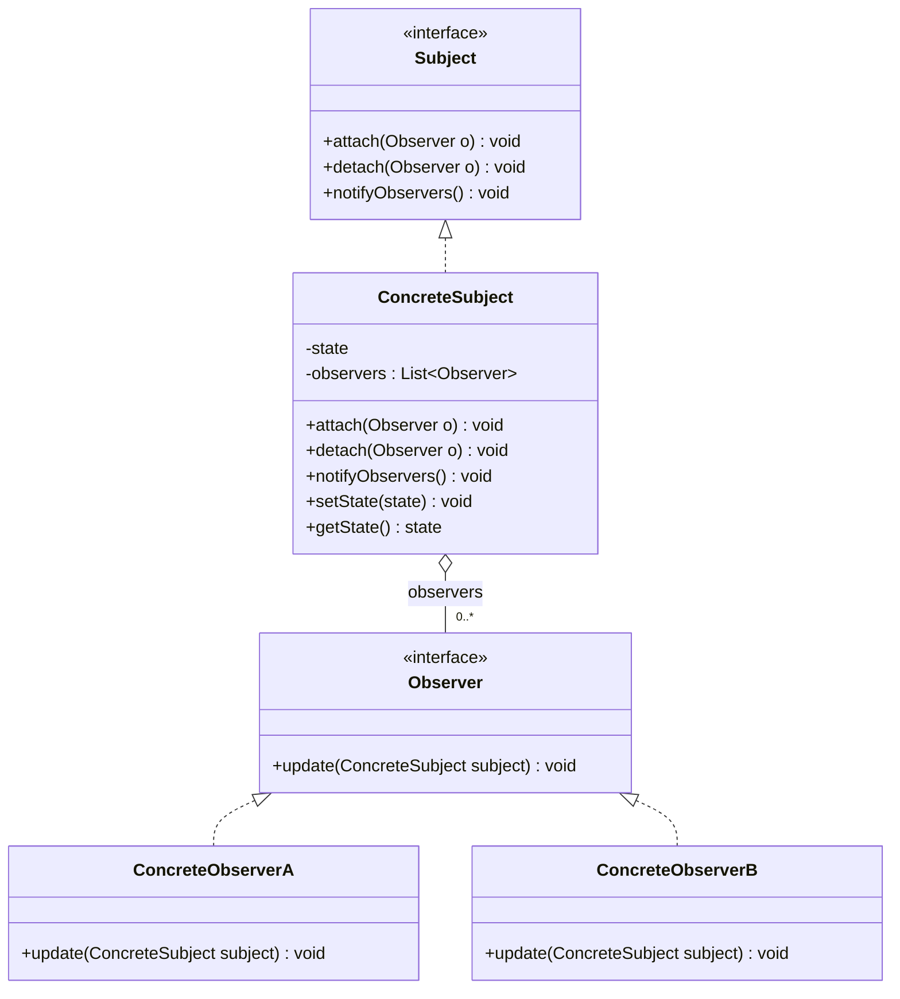
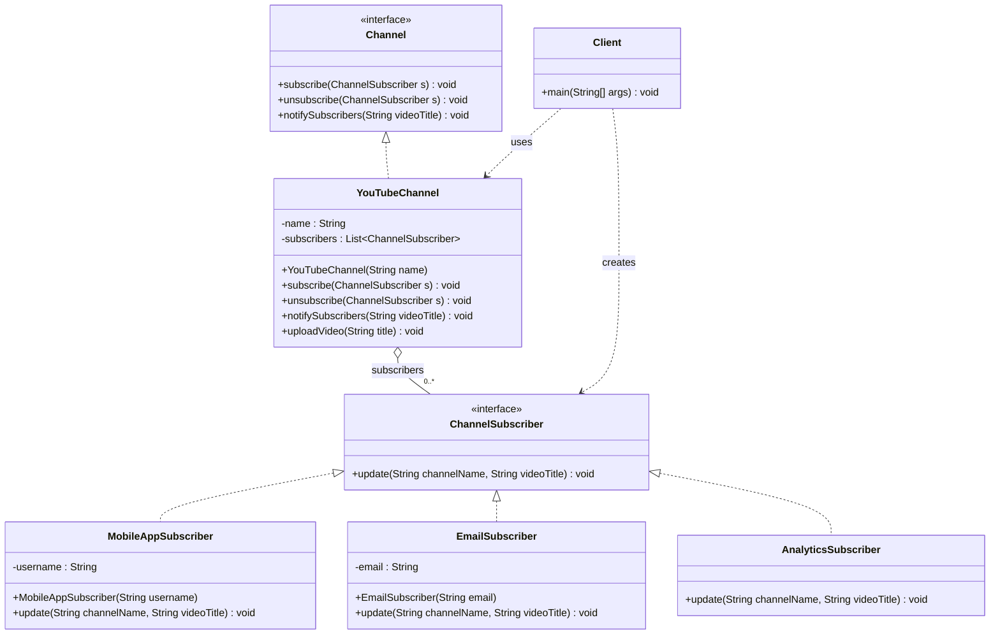

# Observer Pattern

## 1. Motivation 

Imagine your favorite **YouTube channel**.

- Every time the creator uploads a **new video**, you want to know about it.
- Your friend wants a **mobile notification**.
- Your cousin wants an **email**.
- A small dashboard wants to **track how many videos** were uploaded.

The YouTube channel should not have to **personally call** everyone:

- "Hey, send a mobile push to Alice"
- "Hey, send an email to Bob"
- "Hey, update the analytics dashboard"

That would make the channel class **know too much** about every kind of listener.

Instead, it would be nicer if:

- People (and systems) can **subscribe** to the channel.
- Whenever a new video is uploaded, the channel just says:
  - "I uploaded something new" to **all subscribers**.
- Each subscriber decides **how** to react (show notification, send email, update chart, etc.).

This is exactly what the **Observer Pattern** helps with:

- There is one source of truth (the **subject**, e.g., YouTube channel).
- There can be many **observers** (subscribers, services, dashboards).
- When something changes in the subject, it **notifies all observers**.
- The subject does not need to know **who** they are or **what** they do.

---

## 2. Real-World Example *Without* Observer Pattern

Scenario:

- We build a tiny model of a **YouTube channel**.
- When the channel uploads a new video, it should:
  - Send a **mobile app notification**.
  - Send an **email notification**.
- We put all this logic **directly inside the channel class**.

### Code: Without Observer Pattern

See: [WithoutObserverPattern.java](WithoutObserverPattern.java)

Key idea in that file:

- `YoutubeChannelWithoutObserver` has direct references to concrete services:
  - `MobileAppNotificationService`
  - `EmailNotificationService`
- When `uploadVideo(title)` is called:
  - It logs the upload.
  - It **manually** calls both services:
    - `mobileService.sendNewVideoNotification(...)`
    - `emailService.sendNewVideoNotification(...)`
- The `main` method:
  - Creates the notification services.
  - Injects them into `YoutubeChannelWithoutObserver`.
  - Calls `uploadVideo(...)` a few times.

### What is the problem with this solution?

1. **Tight coupling to concrete classes**
   - The channel knows **exactly which services** exist.
   - It calls their concrete methods (`sendNewVideoNotification`).
   - If we ever want to add **SMS**, **webhooks**, or **Slack alerts**, we must **edit the channel class**.

2. **Violation of Open/Closed Principle**
   - The channel should be **open for extension** (new subscriber types)
     but **closed for modification**.
   - Here, every time we add a way to react to a new video, we **change** the channel code.

3. **Difficult to scale subscribers**
   - If there are 2, 3, 5, or 10 different listeners,
     `uploadVideo` becomes a long list of method calls.
   - The channel class grows and becomes harder to read and maintain.

4. **Hard to reuse or test notification logic independently**
   - The logic for "what to do on new video" lives partly inside the channel.
   - Testing each reaction separately becomes awkward.

5. **No simple way to subscribe/unsubscribe at runtime**
   - If a user disables email notifications or uninstalls the app,
     we must change the wiring in the code.
   - There is no clean "subscribe/unsubscribe" mechanism.

This is a classic situation where the **Observer Pattern** fits perfectly.

---

## 3. What is the Observer Pattern?

**Intuition:**

Think of a **school announcement board**:

- The school posts **one announcement** (subject changing state).
- Many students and teachers **look at the board** (they are observers).
- Whenever a new notice appears, everyone who cares can **react**:
  - Some write it in their diary.
  - Some take a picture.
  - Some ignore it.

The board does **not** need to know:

- Who is reading.
- What they will do with the information.

It just **exposes changes**, and whoever is interested **subscribes** by looking at it.

**Formal definition (simplified):**

> Observer Pattern defines a one-to-many dependency between objects so that when one object (subject) changes state, all its dependent objects (observers) are notified and updated automatically.

### Roles in Observer Pattern

- **Subject (Publisher)**
  - Knows its **observers**.
  - Provides methods to **attach** (subscribe) and **detach** (unsubscribe) observers.
  - When its state changes, it **notifies all observers**.

- **Observer**
  - Defines a method (e.g., `update`) that is called when the subject changes.
  - Each observer decides **what to do** when it receives an update.

- **Concrete Subject**
  - A real implementation of the subject.
  - Stores interesting data and calls `notifyObservers()` when it changes.

- **Concrete Observer(s)**
  - Real implementations of observers.
  - Implement `update` to react in their own way.

- **Client Code**
  - Creates the subject and observers.
  - Subscribes observers to the subject.
  - Triggers changes in the subject (which then notifies observers).

---

## 4. General Observer Pattern Class Diagram (Mermaid)

- `Subject` defines how to **manage observers** and **notify** them.
- `ConcreteSubject` stores the actual **state** and **calls notify** when it changes.
- `Observer` defines a common way to **receive updates**.
- `ConcreteObserverA/B` react in their own custom ways.

---

## 5. Fixing Our YouTube Example Using Observer Pattern

Now we refactor the YouTube channel example to use the **Observer Pattern**.

### Idea

We create:

- A `ChannelSubscriber` interface (observer) that defines how subscribers react to new videos.
- A `Channel` interface (subject) that defines how to:
  - `subscribe`
  - `unsubscribe`
  - `notifySubscribers`
- A concrete subject `YouTubeChannel` that:
  - Holds a list of `ChannelSubscriber`.
  - Calls `update(...)` on each subscriber when a new video is uploaded.

Different subscribers implement `ChannelSubscriber` in their own way:

- `MobileAppSubscriber`
- `EmailSubscriber`
- `AnalyticsSubscriber`

The **channel** just knows it has a list of `ChannelSubscriber`.
It does **not** need to know whether they send an email, show a popup, or write to a log.

### Code: With Observer Pattern

See: [WithObserverPattern.java](WithObserverPattern.java)

Key parts of that file:

- `ChannelSubscriber` (observer interface)
  - Declares `update(String channelName, String videoTitle)`.

- `Channel` (subject interface)
  - Declares methods:
    - `subscribe(ChannelSubscriber subscriber)`
    - `unsubscribe(ChannelSubscriber subscriber)`
    - `notifySubscribers(String videoTitle)`

- `YouTubeChannel` (concrete subject)
  - Stores `name` and a `List<ChannelSubscriber>`.
  - On `uploadVideo(title)`:
    - Prints a log.
    - Calls `notifySubscribers(title)`, which loops through the list and calls `update` on each subscriber.

- `MobileAppSubscriber`, `EmailSubscriber`, `AnalyticsSubscriber` (concrete observers)
  - Each implements `ChannelSubscriber`.
  - Each prints a different, role-specific message when notified.

- `WithObserverPattern.main(...)`
  - Creates a `YouTubeChannel`.
  - Creates multiple subscribers and subscribes them to the channel.
  - Uploads a video -> all subscribers are notified.
  - Unsubscribes one user (`bob`).
  - Uploads another video -> remaining subscribers are notified.

Now, if we want a **new reaction** to new videos, for example:

- `SmsSubscriber`
- `WebhookSubscriber`

We only need to:

- Create a new class that implements `ChannelSubscriber`.
- Subscribe an instance to `YouTubeChannel`.

No changes are needed inside `YouTubeChannel` itself.

---

## 6. Class Diagram for the YouTube Example (Mermaid)

This diagram shows:

- `YouTubeChannel` implements the `Channel` (subject) interface.
- Different subscribers implement the `ChannelSubscriber` (observer) interface.
- `YouTubeChannel` keeps a collection of subscribers and notifies them.
- `Client` wires everything together and triggers uploads.

---

## 7. When Should You Use the Observer Pattern?

Use the Observer Pattern when:

- You have **one object whose state changes**, and **many other objects** that should react.
  - Example: UI elements listening to model changes, notification systems, real‑time dashboards.
- You want to avoid **hard-coding all the dependents** inside the subject.
- You need to **add or remove listeners at runtime** without changing the subject class.
- You see code with **manual lists of callbacks** or a lot of
  "if this listener exists, call it" style logic.
- You want to follow the **Open/Closed Principle**:
  - Add new kinds of observers by adding new classes.
  - Keep the subject class stable.

---

## 8. Benefits of Using Observer Pattern

1. **Loose coupling between subject and observers**
   - The subject only knows observers by their **interface**, not by concrete class.
   - Observers can change independently from the subject.

2. **Easy to add new observers**
   - Just implement the observer interface and subscribe.
   - No changes in the existing subject.

3. **Runtime flexibility**
   - Observers can be **subscribed or unsubscribed dynamically**.
   - Great for use cases where users toggle notifications or views on/off.

4. **Clear separation of concerns**
   - The subject focuses on managing its own state.
   - Each observer focuses on how to **react** to updates.

5. **Better testability and reuse**
   - You can test observers **in isolation** by calling `update` directly.
   - The same observer can listen to different subjects that follow the same contract.

6. **Foundation for event-driven systems**
   - Many event listener, callback, and pub/sub APIs are built on this idea.
   - Understanding Observer Pattern helps you reason about **modern UI frameworks, messaging, and real-time updates**.

This YouTube example gives you a concrete mental model: one **channel** (subject), many **subscribers** (observers), and automatic notifications whenever something new happens.
