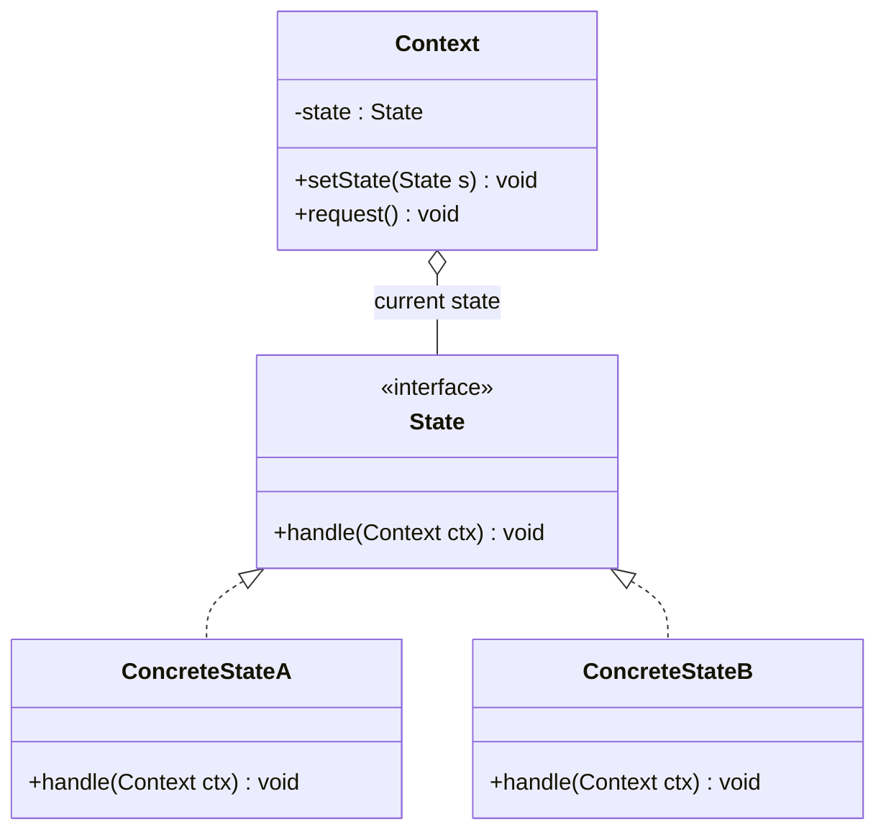
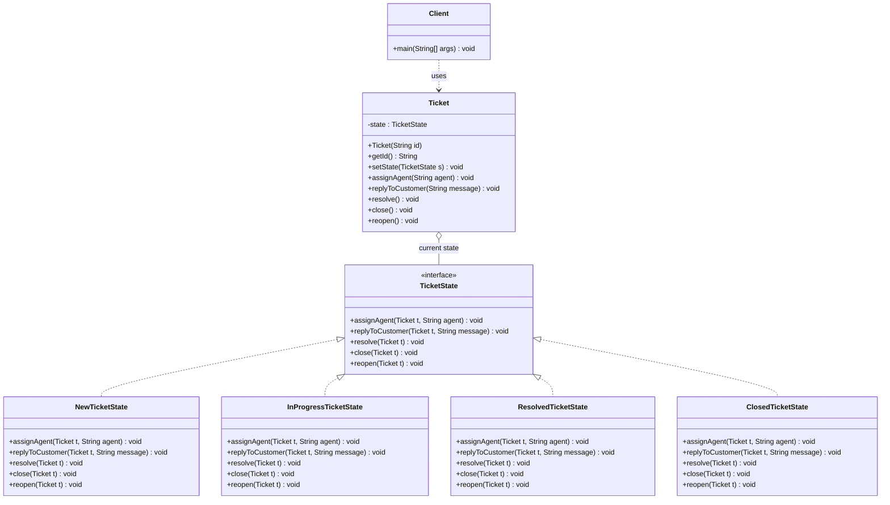

# State Pattern

## 1. Motivation

Imagine a **customer support ticket system** (like what you see in any in-house helpdesk).

Each support request is a **ticket**. A ticket usually goes through different **states** over its lifetime:

- `NEW` – customer just created the ticket.
- `IN_PROGRESS` – an agent is actively working on it.
- `RESOLVED` – the agent believes the problem is fixed.
- `CLOSED` – ticket is fully done and archived.

Common actions on a ticket:

- Assign an agent.
- Reply to the customer.
- Mark as resolved.
- Close the ticket.

What should happen when these actions are performed?

- If the ticket is **NEW** and you **assign an agent** → move to **IN_PROGRESS**.
- If the ticket is **IN_PROGRESS** and you **resolve** it → move to **RESOLVED**.
- If the ticket is **RESOLVED** and the customer is happy → you **close** it.
- If the ticket is **CLOSED**, you usually **cannot reply or change it** in a simple system.

Notice something important:

> The **same action** (assign / reply / resolve / close / reopen) should do **different things depending on the current state** of the ticket.

A naive implementation often ends up with a lot of `if/else` or `switch` statements based on a `status` field. As the workflow grows (more states like `ON_HOLD`, `ESCALATED`, `WAITING_FOR_CUSTOMER`), the code can quickly become messy.

The **State Pattern** helps us model this more cleanly:

- The ticket has a **current state object** (New, InProgress, Resolved, Closed).
- When the system performs an action, the ticket **delegates the behavior** to the current state object.
- Each state **knows how to respond** to each action and **when to transition** to another state.

---

## 2. Real-World Example *Without* State Pattern

Scenario:

- We build a simple `TicketWithoutStatePattern` class.
- It keeps a field `status` (an enum) that can be:
  - `NEW`
  - `IN_PROGRESS`
  - `RESOLVED`
  - `CLOSED`
- Each action (`assignAgent`, `replyToCustomer`, `resolve`, `close`, `reopen`) uses a `switch` statement to decide what to do.

### Code: Without State Pattern

See: [BadCode/WithoutStatePattern.java](BadCode/TicketingSystem.java)

Key idea in that file:

- `TicketWithoutStatePattern` has a field `TicketStatusWithoutStatePattern status`.
- Every public method (`assignAgent`, `replyToCustomer`, `resolve`, `close`, `reopen`) contains `switch (status)` logic.
- The `main` method simply simulates ticket operations and prints what happens.

### What is the problem with this solution?

1. **Complex conditional logic everywhere**
  - Every time you add or change a state, you must touch **all** methods with `switch (status)`.
  - Logic for "what happens when I resolve a NEW ticket" or "reopen a CLOSED ticket" is buried inside a big conditional.

2. **Violation of Open/Closed Principle**
  - If you introduce a new state (e.g., `ON_HOLD` or `ESCALATED`), you must **modify existing methods**.
   - The class is not "closed for modification"; it keeps changing as you add new states.

3. **Hard to see valid transitions**
  - Which transitions are allowed (NEW → IN_PROGRESS, IN_PROGRESS → RESOLVED, RESOLVED → CLOSED, etc.) is spread across `switch` blocks.
   - It is easy to forget to handle a new combination in one of the methods, leading to **bugs or inconsistent behavior**.

4. **Low cohesion and poor readability**
  - The `TicketWithoutStatePattern` class is doing too much: it knows all states and all rules.
  - Reading or explaining the behavior for a single state (e.g., RESOLVED) requires jumping around multiple methods.

This is exactly the kind of problem where the **State Pattern** fits nicely.

---

## 3. What is the State Pattern?

**Intuition:**

Think of a **turnstile gate** in a metro station:

- When it is **locked**, inserting a coin will **unlock** it. Pushing on it does nothing.
- When it is **unlocked**, pushing through will **lock** it again. Inserting another coin is ignored.

The same actions (insert coin, push) cause **different behavior depending on the current state**.

We could implement this with `if/else` based on a variable, but it becomes harder to manage when states and rules grow.

The **State Pattern** says:

> Represent different states as separate classes. The object (context) keeps a reference to a current state object and **delegates behavior** to it. Each state class decides how to handle a request and which state to move to next.

### Roles in State Pattern

- **Context**
  - Holds a reference to a **State** object that represents the current state.
  - Exposes methods that clients call (e.g., `assignAgent`, `replyToCustomer`, `resolve`, ...).
  - Delegates the work to the current state.

- **State (interface / abstract class)**
  - Declares methods for state-specific behavior.
  - Example in our ticket system: `assignAgent`, `replyToCustomer`, `resolve`, `close`, `reopen`.

- **Concrete State(s)**
  - Implement the behavior for a particular state of the Context.
  - Decide when and how to **transition** the context to another state.

- **Client Code**
  - Works with the Context, not with individual states.
  - Usually does not know which exact state the context is in.

---

## 4. General State Pattern Class Diagram (Mermaid)

- `Context` has a reference to a `State` and delegates work to it.
- `State` is the common interface for all states.
- `ConcreteStateA` and `ConcreteStateB` implement the real behavior.
- Each concrete state can decide to change the context's state.

---

## 5. Fixing Our Ticket System Using State Pattern

Now we refactor the ticket system example to use the **State Pattern**.

### Idea

We create:

- A `TicketState` interface (the **State**).
- Concrete states:
  - `NewTicketState`
  - `InProgressTicketState`
  - `ResolvedTicketState`
  - `ClosedTicketState`
- A `Ticket` class (the **Context**) that:
  - Holds a field `TicketState state`.
  - Delegates `assignAgent`, `replyToCustomer`, `resolve`, `close`, `reopen` to the current `state`.

Each state knows how to react to each action:

- In `NewTicketState`, `assignAgent` or `replyToCustomer` moves to `InProgressTicketState`.
- In `InProgressTicketState`, `resolve` moves to `ResolvedTicketState`.
- In `ResolvedTicketState`, `close` moves to `ClosedTicketState` and `reopen` moves back to `InProgressTicketState`.
- In `ClosedTicketState`, most actions are ignored with a clear message.

### Code: With State Pattern

See: [GoodCode/WithStatePattern.java](GoodCode/WithStatePattern.java)

Key parts of that file:

- `TicketState` (state interface)
  - Declares `assignAgent(Ticket ticket, String agentName)`, `replyToCustomer(Ticket ticket, String message)`, `resolve(Ticket ticket)`, `close(Ticket ticket)`, `reopen(Ticket ticket)`.

- `NewTicketState`, `InProgressTicketState`, `ResolvedTicketState`, `ClosedTicketState` (concrete states)
  - Each implements `TicketState`.
  - Each method contains the behavior for that state and decides when to `ticket.setState(new ...)`.

- `Ticket` (context)
  - Holds a `TicketState state`.
  - Starts in `NewTicketState`.
  - Public methods simply delegate to `state`.

- `WithStatePattern.main(...)` (client)
  - Creates a `Ticket`.
  - Simulates ticket operations and prints what happens.

Now, if we want to introduce a new state, such as `OnHoldTicketState` or `EscalatedTicketState`, we can:

- Create a new class implementing `TicketState`.
- Decide from which existing states the ticket can transition into this new state.
- We **do not** need to rewrite every `switch` statement in one giant class.

---

## 6. Class Diagram for the Ticket Example (Mermaid)

This diagram shows:

- `MusicPlayer` holds the current `PlayerState`.
- Different concrete states implement `PlayerState`.
- The client talks only to `MusicPlayer` and has no idea which concrete state is active.

---

## 7. When Should You Use the State Pattern?

Use the State Pattern when:

- An object must behave **differently depending on its internal state**, and this behavior can change at runtime.
  - Example: customer tickets (new/in-progress/resolved/closed), orders (created/paid/shipped/cancelled), user sessions (anonymous/authenticated/blocked).
- You see **large conditional statements** (`if/else`, `switch`) that check a **state field** in many methods.
- You want to avoid scattering **state transition rules** across multiple places in your code.
- You want each state to be **independent, testable**, and easy to evolve.

---

## 8. Benefits of Using the State Pattern

1. **Cleaner, more readable code**
   - Behavior for each state lives in its **own class**.
   - No need for giant `switch` statements repeated in multiple methods.

2. **Open for extension, closed for modification**
   - Adding a new state usually means adding a **new class**, not changing existing logic everywhere.

3. **Explicit and safe state transitions**
   - Each state class controls which transitions are allowed.
   - It becomes harder to end up in an **invalid combination of flags**.

4. **Better separation of concerns**
   - The Context focuses on **delegation** and basic data.
   - Each State focuses only on **behavior for that state**.

5. **Improved testability**
   - You can test each state class in isolation by passing a fake or real Context.

6. **Easier to reason about complex workflows**
   - For workflows with many steps (order lifecycle, authentication flows, UI components), the State Pattern gives a clear mental and visual model of how the system behaves in each phase.

This ticket system example gives you a concrete mental model: one **ticket** (context) and several **states** (new, in progress, resolved, closed), where **the same operations are handled differently depending on the current state**.
