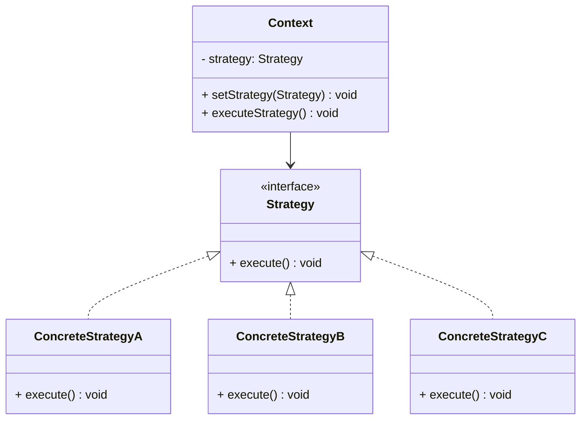
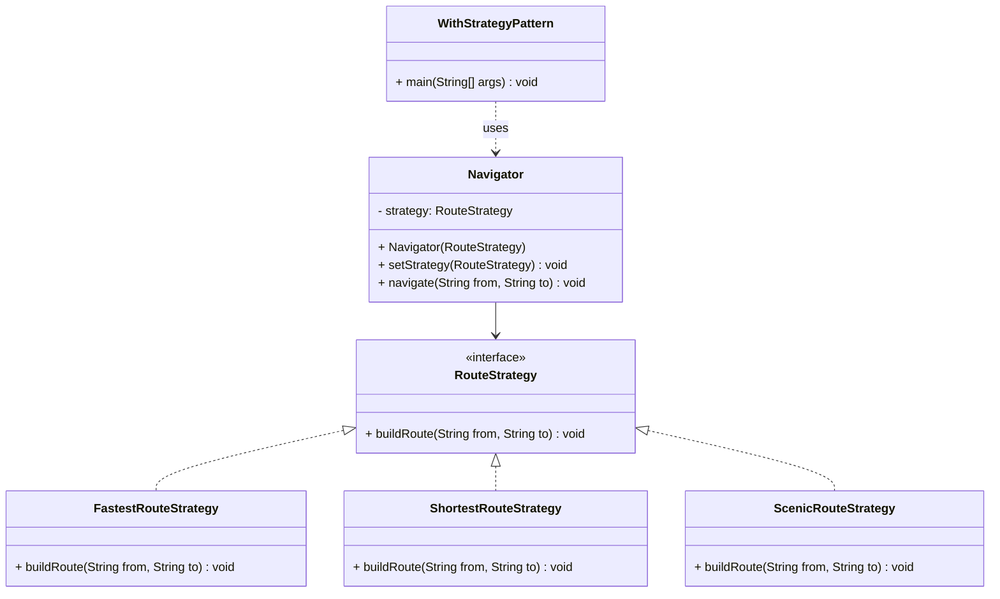

# Strategy Pattern

## 1. Motivation (Explain Like I'm 6)

Imagine you are going from **home to school** every day.

Sometimes you want:
- the **fastest** way (maybe by car on the highway),
- sometimes the **shortest** way (a tiny shortcut on foot),
- sometimes the **prettiest** way (walking past the park and the lake).

You always start at **home** and end at **school**, but **how** you get there can change.

Imagine if your Mom had to write detailed instructions for each route type with a conditional logic. 

```
If (you want faster route) { take this }
else if (you want scenic route) { take this }
else { take this }
```

This would create one big list of all the routes.

**What if there are many routes?**

You will end up with a huge list of pages that you will have to read through fully to finally get to the appropriate kind of route you desire to take.

```
If (you want fastest route) { take this }
else if (you want scenic route) { take this }
else if (you want shortest route) { take this }
else if (you want cheapest route) { take this }
else if (you want cheaper but more scenic route) {   
  take this 
}
```

With the **Strategy Pattern** you can build a **smart navigation app** where:
- The app knows: "I need to go from A to B".
- You can **plug in different route strategies**: fastest, shortest, scenic.
- The app doesn't change; you just **swap the strategy**.

So we:
- Keep the **overall task** the same: go from A to B.
- Put each **different way of doing it** into its own separate class.

---

## 2. Real-World Example *Without* Strategy Pattern

Scenario:
- We build a simple navigation helper that can calculate three kinds of routes:
  - `FASTEST`
  - `SHORTEST`
  - `SCENIC`
- All logic lives inside **one big class** with `if-else` checks.

### Code: Without Strategy Pattern

See: [WithoutStrategyPattern.java](WithoutStrategyPattern.java)

Key idea in that file:
- `RoutePlannerWithoutStrategy.calculateRoute(from, to, routeType)` does everything.
- Inside it, we have a big `if-else` chain:
  - if `routeType` is `FASTEST` - do fastest route logic.
  - else if `routeType` is `SHORTEST` - do shortest route logic.
  - else if `routeType` is `SCENIC` - do scenic route logic.
- The `main` method just calls `calculateRoute` with different route types.

### What is the problem with this solution?

1. **Too many responsibilities in one class**
   - `RoutePlannerWithoutStrategy` decides **which** route type to use **and** also knows **how** to calculate each route.
   - This mixes the job of **choosing the algorithm** with **running the algorithm**.

2. **Adding new route types is painful**
   - Suppose we want a new type like `AVOID_TOLLS` or `SAFE_AT_NIGHT`.
   - We must **open and modify** the `RoutePlannerWithoutStrategy` class.
   - This violates the **Open/Closed Principle** (classes should be open for extension, but closed for modification).

3. **Growing `if-else` / `switch` logic**
   - As routes grow from 3 to 5 to 10 types, the `if-else` chain becomes long and ugly.
   - It becomes easier to make mistakes (typos in strings like "FASTEST", or forgetting a case).

4. **Harder to test and reuse**
   - If you want to test just the scenic route logic, you still depend on the giant method with all other cases.
   - You can't easily **reuse** the scenic route calculation somewhere else without copying code.

5. **Hard to change behavior at runtime in a clean way**
   - If a parent wants to let the child choose the route type dynamically, you end up passing strings around and relying on `if-else` checks everywhere.

This is exactly the kind of problem where the **Strategy Pattern** helps.

---

## 3. What is the Strategy Pattern?

**Intuition (for a 6-year-old):**

Think of a **backpack full of tools**:
- Sometimes you need **scissors**.
- Sometimes you need a **glue stick**.
- Sometimes you need a **marker**.

You keep **one backpack**, but you can **pick the tool** you want **right now**.

In Strategy Pattern:
- The **backpack** is like the main object (the *context*).
- Each **tool** (scissors, glue, marker) is a different **strategy**.
- You can **swap tools** without changing how the backpack itself works.

**Formal definition:**

> Strategy Pattern defines a family of algorithms, encapsulates each one, and makes them interchangeable. The context object uses a strategy object, and the algorithm can be changed at runtime without modifying the context.

### Roles in Strategy Pattern

- **Strategy (interface/abstract class)**
  - Declares a method that all strategies must implement (e.g. `buildRoute(from, to)`).

- **Concrete Strategies**
  - Different classes, each implementing the strategy in its own way.
  - Example: `FastestRouteStrategy`, `ShortestRouteStrategy`, `ScenicRouteStrategy`.

- **Context**
  - Holds a reference to a `Strategy`.
  - Delegates the work to the current strategy.
  - Example: `Navigator`.

- **Client Code**
  - Chooses which strategy to use and gives it to the context.
  - Can change the strategy at runtime.

---

## 4. General Strategy Pattern Class Diagram (Mermaid)



- `Context` uses a `Strategy` to perform some operation.
- `Strategy` is the **common interface** for all algorithms.
- `ConcreteStrategyA/B/C` are the **different algorithms** you can plug in.

---

## 5. Fixing Our Example Using Strategy Pattern

Now we refactor the navigation example to use **Strategy Pattern**.

### Idea

We create a `RouteStrategy` interface that defines **how to build a route**. Then we have multiple implementations:
- `FastestRouteStrategy`
- `ShortestRouteStrategy`
- `ScenicRouteStrategy`

The `Navigator` class:
- Holds a `RouteStrategy`.
- Calls `strategy.buildRoute(from, to)`.
- Does **not** know the details of how each route is calculated.

### Code: With Strategy Pattern

See: [WithStrategyPattern.java](WithStrategyPattern.java)

Key parts of that file:

- `RouteStrategy` (interface)
  - Declares `buildRoute(String from, String to)`.

- `FastestRouteStrategy`, `ShortestRouteStrategy`, `ScenicRouteStrategy`
  - Each class implements `RouteStrategy` and provides its own route-building logic.

- `Navigator` (context)
  - Has a field `private RouteStrategy strategy;`.
  - Has `setStrategy(RouteStrategy strategy)` to change behavior at runtime.
  - Its `navigate(from, to)` method simply calls `strategy.buildRoute(from, to)`.

- `WithStrategyPattern.main()`
  - Creates a `Navigator` and starts with `FastestRouteStrategy`.
  - Then switches to `ShortestRouteStrategy`.
  - Then switches to `ScenicRouteStrategy`.
  - The **Navigator code doesn't change**, only the plugged-in strategy does.

Now, if we want a new behavior like `AvoidTollsRouteStrategy`, we:
- Create a new class that implements `RouteStrategy`.
- Set it on the `Navigator` using `setStrategy(...)`.
- No changes are needed inside `Navigator`.

---

## 6. Class Diagram for the Navigation Example (Mermaid)



This shows:
- `Navigator` depends on the abstraction `RouteStrategy`.
- Concrete strategies (`FastestRouteStrategy`, `ShortestRouteStrategy`, `ScenicRouteStrategy`) implement `RouteStrategy`.
- `WithStrategyPattern` uses `Navigator` and indirectly uses strategies.

---

## 7. When Should You Use the Strategy Pattern?

Use Strategy Pattern when:

- You have **one task** that can be done in **many different ways** (many algorithms).
  - Example: different ways to calculate routes, discounts, shipping costs, sorting, compression, etc.
- You want to **change behavior at runtime** easily.
  - Example: user selects "Fastest" vs "Scenic" in your app settings.
- You see **large `if-else` or `switch` statements** choosing behavior based on a type or mode string.
- You want to keep the **core flow** simple, and move complex, changing logic into **separate, focused classes**.
- You want your code to **follow the Open/Closed Principle**:
  - Add new behavior by adding new classes.
  - Avoid constantly modifying the existing context class.

---

## 8. Benefits of Using Strategy Pattern

1. **Removes big `if-else` / `switch` blocks**
   - Each algorithm lives in its own strategy class.
   - The context just delegates work.

2. **Open for extension, closed for modification**
   - You can add new strategies (new algorithms) without changing existing context code.

3. **Cleaner, more focused classes**
   - Each strategy class has a single responsibility: one specific way of doing the job.
   - Easier to read, understand, and maintain.

4. **Easy to change behavior at runtime**
   - Just set a different strategy object on the context.
   - Great for user-selectable behaviors, feature flags, or configuration.

5. **Improved testability and reuse**
   - You can test each strategy class in isolation.
   - The same strategy can be reused in different contexts if needed.

6. **Better separation of concerns**
   - The context focuses on *when* to do things.
   - Strategies focus on *how* to do those things.
