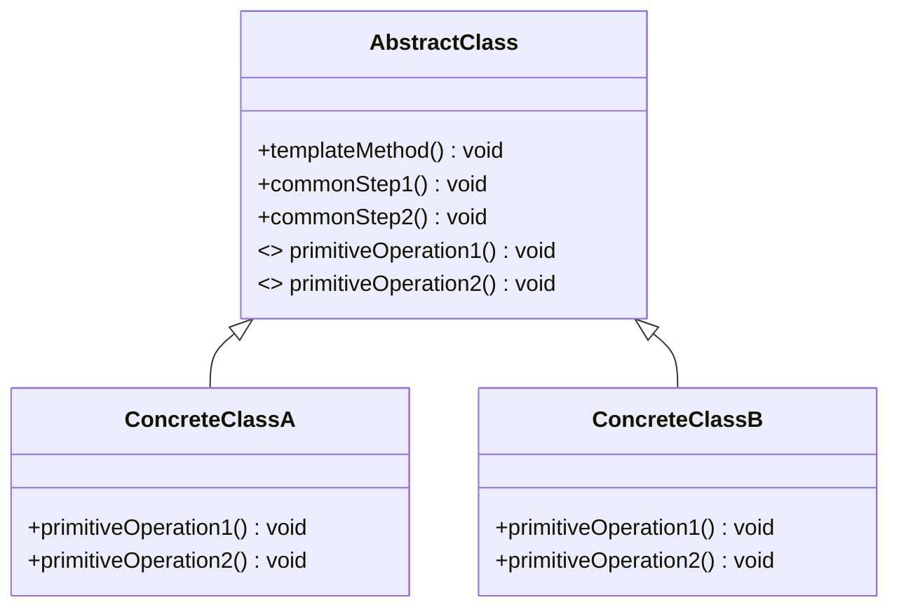
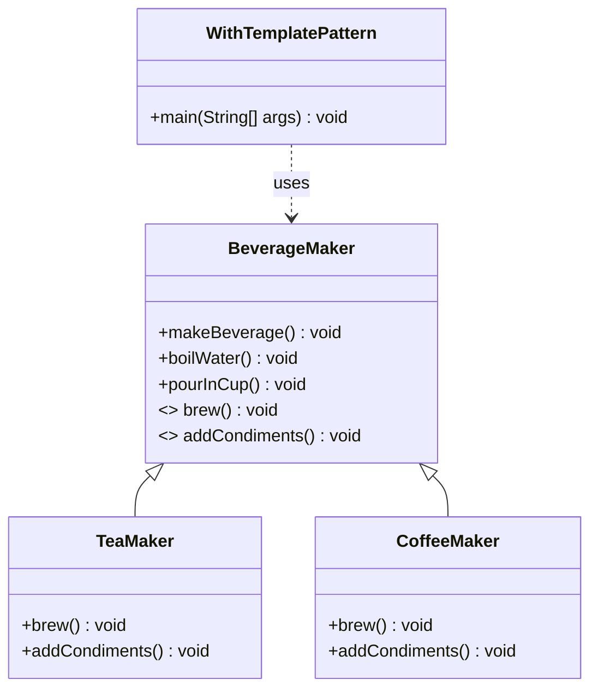

# Template Method Pattern

## 1. Motivation (Explain Like I'm 6)

Imagine you and your friend both like hot drinks.
- You like **tea**.
- Your friend likes **coffee**.

To make any hot drink, you usually:
1. Heat some water.
2. Mix something with the hot water (tea bag or coffee powder).
3. Pour it into a cup.
4. Add something extra on top (like lemon for tea, sugar and milk for coffee).

So the **big steps** are the same, but a **few small steps** in the middle are different.

If every time you write down the entire recipe from scratch for tea, and then again from scratch for coffee, you repeat a lot of the same steps.

The **Template Method Pattern** helps us do this better:
- We write the **big recipe once** (the general steps).
- We let each drink (tea, coffee, hot chocolate, etc.) decide **only the small different parts**.

That way, our code (our recipes) are:
- Easier to read.
- Easier to change.
- Much harder to mess up.

---

## 2. Real-World Example *Without* Template Method

We will start with a small Java example that **does NOT** use the Template Method pattern yet.

Scenario:
- We have two classes
  - `TeaMakerWithoutTemplate`
  - `CoffeeMakerWithoutTemplate`
- Both follow the same overall steps but re-implement everything separately.

### Code: Without Template Method

See: [WithoutTemplateMethod.java](WithoutTemplateMethod.java)

Key idea in that file:

- `TeaMakerWithoutTemplate.makeTea()`:
  - boils water
  - steeps tea bag
  - pours drink in cup
  - adds lemon
- `CoffeeMakerWithoutTemplate.makeCoffee()`:
  - boils water
  - brews coffee grinds
  - pours drink in cup
  - adds sugar and milk

Both classes separately implement:
- `boilWater()`
- `pourInCup()`

### What is the problem with this solution?

1. **Code Duplication**
   - `boilWater()` in tea and coffee does the same thing.
   - `pourInCup()` in tea and coffee does the same thing.
   - If you add more drinks (Hot Chocolate, Green Tea, etc.), youll repeat these methods again.

2. **Hard to Change Common Steps**
   - If you decide to log: `"Starting to prepare drink"` before boiling water,
     you need to update this logic in **every** drink class.
   - This breaks the DRY principle (Dont Repeat Yourself).

3. **Inconsistent Algorithm Flow**
   - Each class is free to reorder or forget some steps.
   - One developer might accidentally skip `pourInCup()` or change the order.
   - There is no single, trusted definition of the **overall algorithm**.

4. **Scales Poorly**
   - As the number of drink types grows, code becomes harder to maintain.
   - Every new drink class must re-implement the same basic lifecycle.

This is exactly the kind of situation where **Template Method Pattern** shines.

---

## 3. What is the Template Method Pattern?

**Intuition (for a 6-year-old):**

Think of it like a **coloring book**:
- The book gives you the **outline** of the drawing (the skeleton).
- You decide **how to color** inside the lines.

In Template Method:
- The **abstract class** is the coloring book outline.
- The **template method** is the big plan: which step comes first, second, third...
- The **subclasses** fill in the missing details (how exactly to do each part).

**Formal definition:**

> Template Method defines the **skeleton of an algorithm** in a base class and lets subclasses override certain steps **without changing** the overall algorithm structure.

### Roles in Template Method

- **Abstract Class**
  - Holds the **template method** (a final method that defines the algorithm steps in order).
  - May define common reusable methods for shared behavior.
  - Declares **abstract methods** for the steps that can vary.

- **Concrete Subclasses**
  - Implement the varying steps (override the abstract methods).
  - Reuse the common behavior from the base class.

- **Client Code**
  - Calls the template method.
  - Doesn't care which subclass is used; it just trusts the algorithm flow.

---

## 4. General Template Method Class Diagram (Mermaid)

- `templateMethod()` calls `commonStep1()`, `primitiveOperation1()`, `primitiveOperation2()`, `commonStep2()` in a fixed order.
- Subclasses (`ConcreteClassA`, `ConcreteClassB`) only override the parts that differ.

---

## 5. Fixing Our Example Using Template Method

Now let's fix the hot-drink example **using** the Template Method pattern.

### Idea

We create an abstract class `BeverageMaker` that defines the **recipe**:
1. Boil water
2. Brew (tea or coffee)
3. Pour into cup
4. Add condiments (lemon for tea, sugar/milk for coffee)

The **order** never changes, but the **implementation** of `brew()` and `addCondiments()` can vary per drink.

### Code: With Template Method

See: [WithTemplatePattern.java](WithTemplatePattern.java)

Key parts of that file:

- `BeverageMaker` (abstract class)
  - `makeBeverage()` is the **template method** (marked `final` so subclasses cant change the order).
  - `boilWater()` and `pourInCup()` are **common steps** with default implementations.
  - `brew()` and `addCondiments()` are **abstract methods** that subclasses must implement.

- `TeaMaker` (concrete subclass)
  - Implements `brew()` with: `"Steeping the tea bag..."`
  - Implements `addCondiments()` with: `"Adding lemon to tea."`

- `CoffeeMaker` (concrete subclass)
  - Implements `brew()` with: `"Brewing coffee grinds..."`
  - Implements `addCondiments()` with: `"Adding sugar and milk to coffee."`

- `WithTemplatePattern.main()`
  - Creates `TeaMaker` and `CoffeeMaker` objects but **treats them as `BeverageMaker`**.
  - Calls `makeBeverage()` on each.

Now, if we add a new drink, say `HotChocolateMaker`, we just:
- Create a new subclass of `BeverageMaker`.
- Implement `brew()` and `addCondiments()`.
- The overall recipe still runs in the correct order.

---

## 6. Class Diagram for the Hot-Drinks Example (Mermaid)

This shows:
- `TeaMaker` and `CoffeeMaker` **inherit** from `BeverageMaker`.
- `WithTemplatePattern` depends on the abstraction `BeverageMaker`, not the concrete drink types.

---

## 7. When Should You Use the Template Method Pattern?

Use Template Method when:

- You have multiple classes that follow **the same overall algorithm** but differ in a **few specific steps**.
- You want to **enforce a fixed order** of steps in an algorithm, but still allow some parts to change.
- You notice **repeated code** across subclasses, especially for setup/cleanup steps.
- You want to put **shared logic in one place** and avoid copy-paste.

Real-world inspired scenarios:
- Different kinds of file importers (CSV, JSON, XML) that all: open file → parse → close file.
- Different payment flows (Credit Card, UPI, Wallet) that all: validate → deduct amount → send receipt.
- Different data processing pipelines (batch jobs) that all: load data → transform → export.

---

## 8. Benefits of Using Template Method

1. **Avoids Code Duplication**
   - Common steps live in the base class.
   - Only variable parts are implemented in subclasses.

2. **Centralized Algorithm Structure**
   - The full algorithm is visible in one place (the template method).
   - Easier to reason about and easier to explain (great for reviews and onboarding).

3. **Consistent Behavior**
   - All subclasses follow the same order of operations.
   - Reduces bugs caused by missing or re-ordered steps.

4. **Easier Maintenance**
   - Change the common behavior once in the base class (e.g., log time, handle errors).
   - All subclasses automatically benefit from the change.

5. **Open/Closed Principle Friendly**
   - You can add new behaviors (new subclasses) **without modifying** the base class.
   - The base algorithm stays stable; only leaf classes evolve.

---
