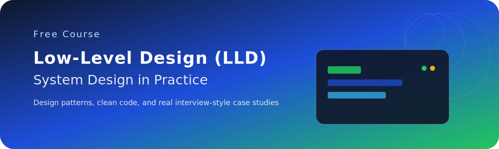

# System Design Course

This repository contains the code and resources for a completely FREE hands‑on course on Low‑Level Design (LLD) / object‑oriented system design.

The goal of the course is to help you go from “I kind of know OOP” to “I can design and implement clean, extensible systems in real interviews and real projects”.

Most examples are in Java, but the design ideas apply to any object‑oriented language.

---

## Repository Structure

- [BehavioralPatterns](BehavioralPatterns)
  - [TemplatePattern](BehavioralPatterns/TemplatePattern)
    - YouTube Link: [Template Method Pattern Explained](https://www.youtube.com/watch?v=nbFTVrR0h8Q&list=PLGyA74h_S9NqESOLW5W2SCSxESNCkycwr)
		- Implementation of Template Method
		- Compare [BadCode.java](BehavioralPatterns/TemplatePattern/BadCode.java) vs [GoodCode.java](BehavioralPatterns/TemplatePattern/GoodCode.java)
  - [StrategyPattern](BehavioralPatterns/StrategyPattern)
    - YouTube Link: [Strategy Method Pattern Explained](https://www.youtube.com/watch?v=MUcUQalnfIc&list=PLGyA74h_S9NqESOLW5W2SCSxESNCkycwr)
		- Implementation of Strategy Pattern Method
		- Compare [BadCode.java](BehavioralPatterns/StrategyPattern/BadCode.java) vs [GoodCode.java](BehavioralPatterns/StrategyPattern/GoodCode.java)
  - [ObserverPattern](BehavioralPatterns/ObserverPattern)
    - YouTube Link: [Observer Pattern Method Explained](https://www.youtube.com/watch?v=BJqe1Tfugn4&list=PLGyA74h_S9NqESOLW5W2SCSxESNCkycwr)
		- Implementation of Observer Pattern Method
		- Compare [BadCode.java](BehavioralPatterns/ObserverPattern/BadCode.java) vs [GoodCode.java](BehavioralPatterns/ObserverPattern/GoodCode.java)
  - [StatePattern](BehavioralPatterns/StatePattern)
    - YouTube Link: [State Pattern Explained](https://www.youtube.com/watch?v=jbaU4UCIrQ8&list=PLGyA74h_S9NqESOLW5W2SCSxESNCkycwr)
		- Implementation of State Pattern Method
		- Compare [BadCode.java](BehavioralPatterns/StatePattern/BadCode.java) vs [GoodCode.java](BehavioralPatterns/StatePattern/GoodCode.java)

Each pattern folder has its own [README](BehavioralPatterns/StrategyPattern/README.md) to accompany the video in the series.

---

## How To Use This Course

1. Watch the corresponding YouTube video for a pattern / concept.
2. Open the matching folder in this repo (for example, [BehavioralPatterns/StrategyPattern](BehavioralPatterns/StrategyPattern)).
3. Go through the README.md and code files:
	- Look at how responsibilities are split into classes and interfaces.
	- See how design principles (like SOLID) are actually applied in code.
5. Experiment:
	- Add new behaviors / requirements.
	- See how easy (or hard) it is to extend the design.

---

## Prerequisites

- Comfortable with at least one OOP language (Java, C#, C++, etc.).
- Able to compile and run simple programs from the command line or an IDE (IntelliJ, VS Code, Eclipse, etc.).

You do **not** need prior knowledge of design patterns; we build them up from real problems, not memorization.

---

## Running The Java Examples

You can run the examples either from an IDE or from the command line.

**Using command line (Windows / PowerShell example):**

1. Navigate to the folder you want to run, e.g.:
	- `cd BehavioralPatterns/StrategyPattern/sample`
2. Compile:
	- `javac *.java`
3. Run the main class:
	- `java StrategyPattern`

Adjust the main class name based on the file you want to execute.

---

## What This Course Will Cover

Planned and in‑progress topics include:

- Core OOP and design principles (encapsulation, abstraction, SOLID, composition over inheritance)
- Classic design patterns (Strategy, Template Method, Factory, Builder, Observer, Decorator, and more)
- Designing clean APIs and class diagrams
- Translating product requirements into concrete classes, interfaces, and workflows
- Real LLD case studies (e.g., feed systems, notifications, parking lot, splitwise, etc.)

This repository will grow over time as new episodes are added.

---

## Contributing / Feedback

This is a teaching repository: issues, suggestions, and improvements are welcome.

If you spot:

- Better naming / cleaner abstractions
- Interesting variations of the patterns
- Small bugs or edge cases

Feel free to open an issue or suggest changes. Your feedback directly helps make the free course better for everyone.

---

## License & Usage

You are free to:

- Use this code to learn and practice.
- Adapt it for your own understanding and interview prep.

Please avoid blindly copying solutions into interview settings; focus on understanding the reasoning and being able to derive designs yourself.

Happy designing!
